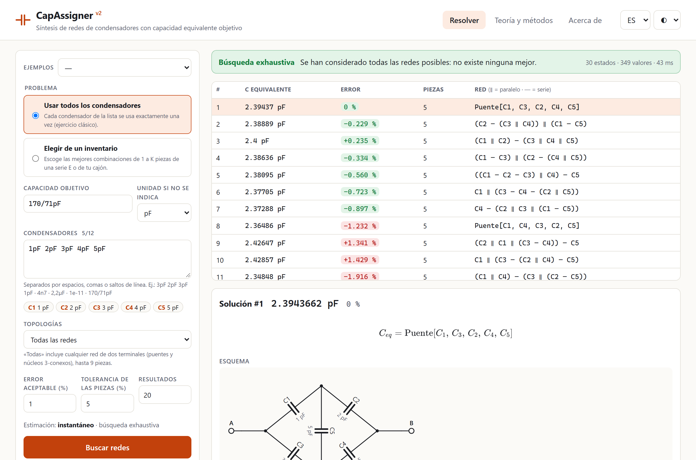

# CapAssigner

[](https://github.com/elloza/CapAssigner/actions/workflows/ci.yml)
[](https://github.com/elloza/CapAssigner/actions/workflows/pages.yml)
[](LICENSE)

**Síntesis de redes de condensadores con una capacidad equivalente objetivo, en el navegador.**

👉 **[Abrir la aplicación](https://elloza.github.io/CapAssigner/)**

Dados unos condensadores y un valor objetivo C\*, CapAssigner encuentra las redes entre dos terminales (serie, paralelo, puentes de Wheatstone y cualquier otra topología) cuya capacidad equivalente más se acerca a C\*. Indica cuándo la respuesta es óptima y verifica cada circuito con aritmética exacta. Todo se calcula en tu navegador con un motor en Rust compilado a WebAssembly: no hay servidor ni se envían datos.



## Qué hace

- **Dos problemas**
  - *Usar todos*: cada condensador de la lista se usa exactamente una vez, como en el ejercicio clásico de clase. Hasta 12 piezas.
  - *Inventario*: elige entre 1 y 6 piezas de una serie E3–E96 (cantidad ilimitada) o de tu cajón con existencias (`10pF×2 4.7pF×3`).
- **Todas las topologías**: serie-paralelo, puentes y cualquier red de dos terminales hasta 9 piezas.
- **Garantía en cada resultado**: la búsqueda es *exhaustiva* (no existe una red mejor) o lleva una *cota demostrada* de lo que el óptimo podría mejorar.
- **Verificación independiente**: análisis nodal, balance de energía, conservación de la carga y valor exacto en fracciones a partir del texto que escribes (`4.7pF` = 47/10 pF; también admite `170/71pF`).
- **Análisis de cada red**: esquema, fórmula, tensión, carga y energía por pieza (la sensibilidad ∂C_eq/∂C_i = Δv²), e intervalo de C_eq con la tolerancia de las piezas.
- **Exportación** a SPICE, CircuiTikZ (LaTeX), SVG y JSON. Cada problema tiene su enlace para compartirlo.
- **Estimación del tiempo** antes de buscar, y progreso con tiempo restante durante la búsqueda, que se puede cancelar.
- Interfaz en español e inglés, con tema claro y oscuro, y adaptada al móvil.

## Formatos de entrada

| Escribes | Significa |
|---|---|
| `4.7pF`, `4,7 pF`, `4p7` | 4,7 pF |
| `10n`, `10nF`, `2.2uF`, `2.2µF`, `1mF`, `15fF` | prefijos f, p, n, µ/u, m |
| `1e-11`, `1.2*10^-12` | faradios, en notación científica |
| `170/71pF` | fracción exacta |
| `5.2` | en la unidad por defecto elegida (pF salvo que la cambies) |

## Cómo funciona (resumen)

1. **Programación dinámica de valores.** Las piezas iguales se agrupan en clases. Para cada multiconjunto de piezas se guarda el conjunto de capacidades *distintas* alcanzables, con una red testigo por valor. Así no se repiten árboles equivalentes.
2. **Encuentro en el medio.** El estado completo no se construye: para cada partición se despeja el complemento exacto (`C* − a` en paralelo, `aC*/(a − C*)` en serie) y se busca por bisección.
3. **Redes no serie-paralelo.** Por la descomposición SPQR, toda red de dos terminales se forma con nodos serie, paralelo y *rígidos* (grafos 3-conexos). El motor genera todos los grafos 3-conexos de hasta 10 aristas y rellena sus aristas con subredes. Así cubre todas las redes de hasta 9 piezas.
4. **Poda con garantía.** Si la memoria no basta, cada conjunto se agrupa en una rejilla logarítmica. Como serie, paralelo y cualquier núcleo son monótonos y 1-homogéneos, la pérdida está acotada por e^{(n−1)ε} − 1, y esa cota se muestra.

La pestaña **Teoría y métodos** de la aplicación lo explica en detalle, con las ecuaciones, el catálogo de núcleos, las garantías, la validación y las líneas futuras. Hay notas técnicas adicionales en [docs/approaches.md](docs/approaches.md).

## Validación

- **Secuencias OEIS, con aritmética racional exacta**: el número de valores distintos con n piezas iguales coincide con A048211 (serie-paralelo, n ≤ 12), A174283 (+ puentes, n ≤ 9), **A337517 (todas las redes, n ≤ 9)** y A006351 (redes SP con piezas distintas, n ≤ 7).
- **Propiedades físicas** probadas sobre redes aleatorias (proptest y fast-check): cotas, homogeneidad, invariancia al reetiquetar, monotonía de Rayleigh, dualidad serie↔paralelo, reciprocidad, transformación Y–Δ, puente equilibrado y fórmula cerrada del puente, energía, Kirchhoff y sensibilidad.
- **Oráculo independiente**: cada resultado del motor se recalcula en TypeScript, en coma flotante y con fracciones exactas.
- **Casos de referencia**: ejercicios de clase y el puente {1,2,3,4,5} pF → 170/71 pF, cuyo mejor valor serie-paralelo es 43/18 pF (0,229 % de diferencia).
- **Pruebas de extremo a extremo** con Playwright sobre la web compilada, incluido un presupuesto de rendimiento.

## Rendimiento orientativo

Modo «usar todos» con valores distintos, en un portátil y en el navegador. Con valores repetidos es mucho más rápido.

| Piezas | Serie-paralelo | Todas las redes | Resultado |
|---|---|---|---|
| ≤ 7 | < 0,1 s | < 0,2 s | exhaustivo |
| 8 | ≈ 0,4 s | ≈ 1,5 s | exhaustivo |
| 9 | ≈ 6 s | ≈ 16 s | cota ≤ 0,05 % |
| 12 | ≈ 50 s | — | cota ≤ 5 % (error real ~1e-9) |

## Desarrollo

Requisitos: Rust estable con el target `wasm32-unknown-unknown`, [wasm-pack](https://github.com/wasm-bindgen/wasm-pack) y Node 22.

```bash
npm ci
npm run dev                      # compila el motor WASM y arranca Vite
npm test                         # Vitest: unidades, oráculo físico, WASM
npm run build && npm run e2e     # Playwright sobre la web compilada
cargo test --workspace --release # motor: unidades, OEIS, propiedades, API
```

```
crates/capcore/   motor en Rust: DP de valores, núcleos 3-conexos, reducción de Kron, racionales, API JSON, wasm-bindgen
src/              aplicación Svelte 5 + TypeScript: worker, oráculo físico, esquemas, exportación, i18n
tests/            pruebas Vitest y Playwright, casos de referencia
docs/             notas técnicas y captura
legacy/           versión anterior en Python, usada para generar casos de referencia
```

Cada push a `main` compila y publica la web en GitHub Pages (`.github/workflows/pages.yml`). La integración continua ejecuta rustfmt, clippy, todas las pruebas y el e2e (`.github/workflows/ci.yml`).

## Líneas futuras

Restricciones de diseño (coste, tensión nominal) con MILP; búsqueda a gran escala (ALNS) con reparación exacta para más de 12 piezas; optimización robusta con tolerancias distintas por pieza; frente de Pareto error/piezas/coste; construcción multihilo; resistencias e inductancias; un benchmark abierto.

---

**English.** CapAssigner finds capacitor networks (series, parallel, bridges, any topology up to 9 parts) whose equivalent capacitance best matches a target. Each result is either exhaustive or comes with a proven bound, and every circuit is verified with exact arithmetic. It runs entirely in the browser (Rust → WebAssembly). [Open the app](https://elloza.github.io/CapAssigner/); the UI is available in English.

## Licencia

[MIT](LICENSE)
